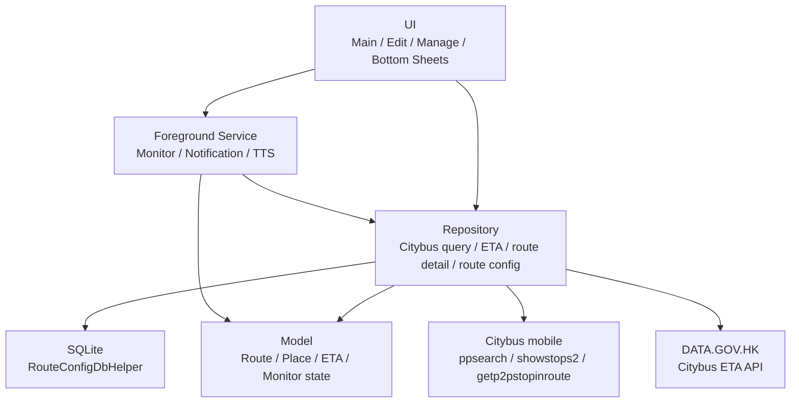

<div align="center">
  

# BusIsComing

一個面向香港巴士通勤場景的 Android App，用於保存常用起終點、快速比較 Citybus 點到點路線，並在出門前監控首程巴士 ETA。

</div>

## 功能特色

- **常用路線管理**：新增、編輯、複製、刪除常用起終點配置。
- **Citybus 地點搜尋**：起點與終點從 Citybus 候選地點中選擇，降低地址輸入歧義。
- **快速路線查詢**：主頁展示常用路線快捷卡，也支援不保存的臨時查詢。
- **路線結果卡片**：聚合展示路線、上落車站預覽、票價、總耗時、步行距離和候車狀態。
- **多班 ETA**：卡片突出首程下一班車，並可打開底部面板查看最多 3 班到站時間。
- **路線詳情**：點擊路線卡片查看上下車站點、途經站點與換乘段。
- **排序與刷新**：支援按路線、價格、耗時、候車和步行距離排序，並可下拉刷新結果。
- **通知欄監控**：以前台服務定期刷新首程 ETA，提供出門狀態、刷新、停止和語音提醒能力。

## 技術棧

| 類別 | 技術 |
| --- | --- |
| 語言 | Kotlin |
| UI | XML, AppCompat, Material Components |
| 清單與刷新 | RecyclerView, SwipeRefreshLayout |
| 本機資料 | SQLiteOpenHelper |
| 解析 | jsoup, 輕量 JSON 欄位解析 |
| 背景能力 | Foreground Service, NotificationCompat, AlarmManager, TextToSpeech |
| 測試 | JUnit, AndroidX Test, Espresso, Citybus HTML fixture |
| 構建 | Gradle Kotlin DSL, Android Gradle Plugin 9.2.1 |

## 系統需求

- Android Studio：支援 Android Gradle Plugin 9.x 的版本
- Android SDK：compileSdk 36.1，minSdk 25，targetSdk 36
- Java compatibility：Java 11

## 快速開始

```bash
cd BusIsComming
./gradlew build
```

取得專案後，使用 Android Studio 打開根目錄，選擇 `app` module 執行到模擬器或實機。

常用命令：

```bash
# 完整構建、單元測試、lint 和 assemble
./gradlew build

# 只執行本地單元測試
./gradlew testDebugUnitTest

# 安裝 debug app 到已連接裝置
./gradlew :app:installDebug

# 查看可用 Android 裝置
adb devices
```

## 專案結構

```text
BusIsComing/
├── app/                 Android App 模組
│   └── src/
│       ├── main/        App 代碼、資源與 AndroidManifest
│       ├── test/        本地單元測試與 Citybus fixture
│       └── androidTest/ Android instrumentation 測試
├── docs/                Citybus 資料推導、UI 風格與產品文檔
├── openspec/            OpenSpec 規格、變更提案與任務
├── gradle/              Gradle wrapper 與 version catalog
├── AGENTS.md            專案級 agent 開發約定
├── build.gradle.kts     根專案構建配置
└── settings.gradle.kts  Gradle settings
```

## 架構概覽

BusIsComing 採用輕量 Repository 分層，保持 UI、資料存取、解析、背景服務之間的邊界清晰。



主要代碼分層：

| 目錄 | 職責 |
| --- | --- |
| `data/local` | SQLite schema 與本地資料庫 helper |
| `data/model` | 路線、地點、ETA、排序、通知監控等領域模型 |
| `data/repository` | Citybus 查詢、解析、路線詳情、ETA 和本地配置資料存取 |
| `service` | 通知欄監控、刷新調度、TTS 和 session 持久化 |
| `ui/common` | 共用輸入和 WindowInsets 工具 |
| `ui/edit` | 路線新增與編輯 |
| `ui/manage` | 路線管理 |
| `ui/main` | 主頁查詢、結果卡片、底部彈層與監控入口 |

## 資料來源

| 來源 | 用途 |
| --- | --- |
| `ppsearch_p3.php` | Citybus 點到點候選路線 |
| `showstops2.php` | 基於 P2P rawInfo 對齊路線 variant、停站與 stop id |
| `getp2pstopinroute.php` | 路線詳情、上下車站點與途經站點 |
| `rt.data.gov.hk/v2/transport/citybus/eta/...` | 首程即時 ETA |

> [!IMPORTANT]
> `showstops2.php` 用於處理 P2P 路線 variant 與公開路線站序不一致的情況。修改 ETA 或站點對齊邏輯時，請同步更新 fixture 或針對性回歸測試。

## OpenSpec 工作流

`openspec/` 記錄了專案的規格驅動開發過程：

- `openspec/specs/`：已歸檔並生效的能力規格。
- `openspec/changes/`：進行中的變更提案、設計和任務。
- `openspec/changes/archive/`：已完成並歸檔的變更。
