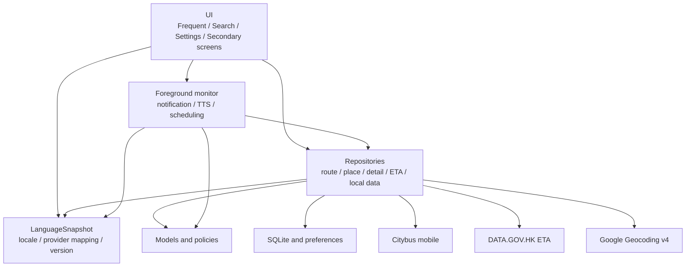

<div align="center">
  

# BusIsComing

一個為香港巴士通勤而設的 Android App：保存常用起終點、比較 Citybus 點到點路線，並在出門前監控首程巴士 ETA。

[官方網站](https://www.busiscoming.com/)

</div>

## 主要功能

- **常用路線**：新增、編輯、複製、刪除及按目前位置距離排序；同一路線連續查詢或刷新只記錄一次使用。
- **臨時搜尋**：不保存路線也可選擇起終點、查詢結果及一鍵另存為常用路線。
- **即時結果**：比較路線、HK$ 車費、總耗時、步行距離、首程 ETA 與最多三班到站時間。
- **路線詳情**：查看上下車站、途經站、方向與換乘段；P2P stop map 用於對齊 route variant 及 stop id。
- **通知欄監控**：短時前台服務定期刷新 ETA，顯示準備出門／立即出門／可能遲到狀態，並可刷新、停止及語音播報。
- **路線匯入匯出**：透過 Android 系統文件選擇器匯出全部 `.bicroutes`，或預覽後合併／取代本機路線。
- **三語介面**：跟隨系統、繁體中文、簡體中文、English；Citybus、Google 地址、DATA.GOV.HK ETA、通知與 TTS 使用同一實際語言。
- **外觀主題**：跟隨系統、淺色、深色；外觀與語言偏好互相獨立。

## 技術概覽

| 類別 | 技術 |
| --- | --- |
| 語言與 UI | Kotlin、XML、AppCompat、Material Components |
| 本地化 | Android resources、AppCompat per-app locales |
| 清單與刷新 | RecyclerView、SwipeRefreshLayout |
| 本機資料 | SQLiteOpenHelper、SharedPreferences |
| 網絡與解析 | HTTPS、jsoup、輕量 JSON 解析 |
| 定位 | Google Play services Location、Google Geocoding v4 |
| 背景能力 | Foreground Service、NotificationCompat、AlarmManager、TextToSpeech |
| 測試 | JUnit、AndroidX Test、Espresso、Citybus fixture、真實服務驗證 |
| 構建 | Gradle Kotlin DSL、Android Gradle Plugin 9.2.1 |

系統目標：compileSdk 36.1、minSdk 25、targetSdk 36、Java 11。

## 快速開始

1. 使用支援 Android Gradle Plugin 9.x 的 Android Studio 打開專案根目錄。
2. 如需目前位置地址解析，在不提交到版本控制的 `local.properties` 設定：

   ```properties
   GOOGLE_GEOCODING_API_KEY=your_api_key
   ```

   也可使用同名環境變數。Google key 必須配合 App package 與 signing certificate 限制。

3. 構建及安裝：

   ```bash
   ./gradlew build
   ./gradlew :app:installDebug
   ```

> [!IMPORTANT]
> 專案使用真實 Citybus、DATA.GOV.HK 與 Google 服務。Fixture 只用於 parser 回歸，不能替代生產 HTTP 或真實三語驗證。

## 架構

BusIsComing 採用輕量 Repository 分層。UI 負責展示、輸入與生命週期；HTTP、SQLite、HTML／JSON 解析及查詢編排留在 repository；監控、通知、排程與 TTS 留在 service。


```mermaid
flowchart TD
    UI["UI\nFrequent / Search / Settings / Secondary screens"]
    Language["LanguageSnapshot\nlocale / provider mapping / version"]
    Repo["Repositories\nroute / place / detail / ETA / local data"]
    Model["Models and policies"]
    Local["SQLite and preferences"]
    Citybus["Citybus mobile"]
    Gov["DATA.GOV.HK ETA"]
    Google["Google Geocoding v4"]
    Service["Foreground monitor\nnotification / TTS / scheduling"]

    UI --> Repo
    UI --> Service
    UI --> Language
    Repo --> Language
    Repo --> Model
    Repo --> Local
    Repo --> Citybus
    Repo --> Gov
    Repo --> Google
    Service --> Repo
    Service --> Language
    Service --> Model
```

| 目錄 | 職責 |
| --- | --- |
| `data/local` | SQLite helper、語言與外觀偏好 |
| `data/localization` | locale policy、`LanguageSnapshot`、provider／TTS mapping |
| `data/location` | 目前位置、距離與 Google 地址解析 |
| `data/model` | 路線、地點、ETA、排序、監控等結構化狀態 |
| `data/repository` | Citybus／ETA 查詢、parser、route detail、cache 與本機路線 |
| `data/transfer` | `.bicroutes` 匯入匯出格式 |
| `service` | 前台監控、通知、排程、session、TTS 與本地化 formatter |
| `ui` | 三個頂層 destination、編輯／管理／設定頁及共用 UI |

常用與搜尋是兩個獨立 query owner。語言或主題造成 Activity recreation 時，App 保存 destination、起終點、排序與滾動位置，但不保存舊結果；已提交的有效上下文會以原座標自動重查，舊語言 callback 由 generation 與語言版本共同拒絕。

## 外部資料來源

| 來源 | 用途 | 語言契約 |
| --- | --- | --- |
| `bsearch_p3.php` | Citybus 地點候選 | `l=0/2/1`；保留 `q`、`limit=100`、`timestamp` |
| `ppsearch_p3.php` | 點到點候選路線 | `l=0/2/1`，聚合 T/F/W `m1` |
| `showstops2.php` | P2P route variant、站序與 stop id 對齊 | 與路線查詢使用相同 `l` |
| `getp2pstopinroute.php` | 上下車站、途經站與換乘段 | cache key 包含語言 |
| DATA.GOV.HK Citybus ETA | 首程即時到站資料 | tc／sc／en 依目前語言作單欄位官方回退 |
| Google Geocoding v4 | 目前座標的地址名稱 | `zh-Hant/zh-Hans/en` + `regionCode=HK` |

Citybus mobile 請求不附加 Cookie、Referer、User-Agent 或 X-Requested-With 等瀏覽器 header。修改參數或 parser 時，必須保留可復現的脫敏請求、fixture 或針對性回歸證據。

## 本機資料與私隱

常用路線保存在 App 的 SQLite 資料庫。`.bicroutes` 是未加密的版本化 UTF-8 JSON，只包含路線名稱、起終點地點名稱與精確座標；不包含使用次數、最近使用時間、查詢結果、ETA、定位狀態或通知監控資料。

> [!WARNING]
> 匯出檔案包含精確座標，請只交給信任的人。匯入匯出使用系統文件選擇器，不要求外部儲存權限。

## 驗證

```bash
# 本地單元與 contract 測試
./gradlew testDebugUnitTest

# 編譯、全部本地測試、lint、debug／release assemble
./gradlew build

# 已連接模擬器／實機上的 instrumentation
./gradlew connectedDebugAndroidTest

# OpenSpec change 驗證
openspec validate <change-id> --strict
```

UI 驗收覆蓋三語 × 淺／深色、約 360dp portrait、font scale 1.0／1.3／2.0、TalkBack、Dialog、Bottom Sheet 與通知。詳細規則見 [本地化指南](docs/localization-guidelines.md)、[驗收矩陣](docs/localization-validation-matrix.md) 及 [UI 風格指南](docs/ui-style-guide.md)。

## 專案結構與規格

```text
BusIsComing/
├── app/src/main/       App 程式、資源與 Manifest
├── app/src/test/       JVM 測試與 fixture
├── app/src/androidTest/ 裝置／模擬器測試
├── docs/               架構、資料、UI 與本地化指南
├── openspec/specs/     已生效能力規格
├── openspec/changes/   進行中與已歸檔 change
├── AGENTS.md           專案級 agent 規則
└── README.md
```

OpenSpec 人類可讀內容及專案文件使用繁體中文；App runtime 文案則必須完整提供繁體、簡體與英文。進入專案時先閱讀 `AGENTS.md`、相關 `openspec/specs/`／change、測試及 `docs/`。
