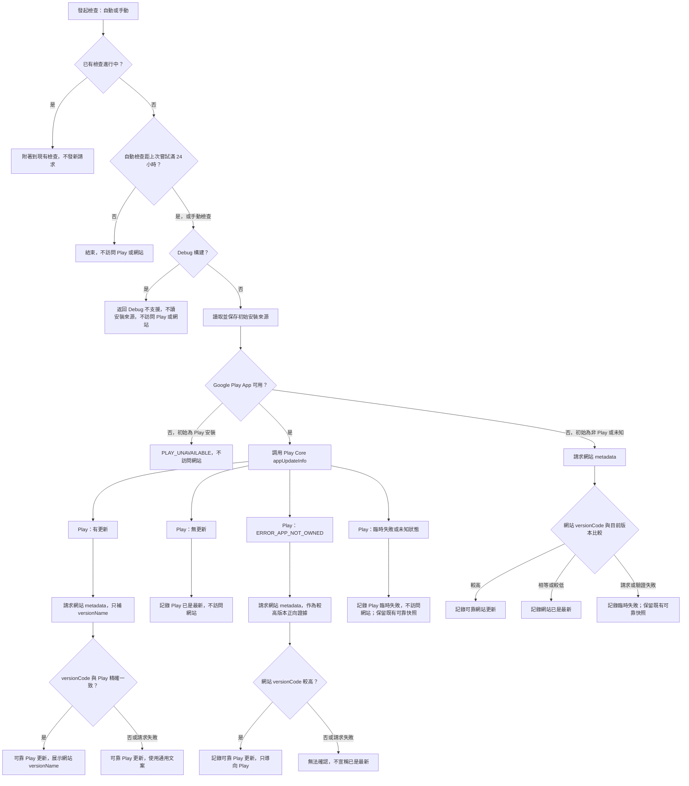

# 應用程式更新檢查

## 文件目的

本文件記錄更新檢查的長期渠道決策、狀態語義、網站 metadata 契約、Google Play 評分入口邊界與發布驗證證據。畫面文案與三語要求見 `localization-guidelines.md`。

目前 App 版本由 `app/build.gradle.kts` 定義；截至本次文檔同步為 `versionCode=16`、`versionName=1.1`。下文的 v11 數據只是一筆歷史發布證據，不代表目前版本。

## 整體流程

自動與手動檢查共用 `AppUpdateCoordinator`。已有檢查時不建立第二個 provider 請求，而是附著到同一工作；手動觸發可以要求把同一結果展示給用戶。



## 渠道與可靠性規則

### Play 優先

- Release 構建只要 Google Play App 可用，就以 Play 對目前帳號、軌道、地區及裝置返回的結果為資格權威，不以網站的全局版本覆蓋它。
- 初始安裝來源一經確定便保存。初始為 Play 安裝而 Play 後來不可用時，返回 `PLAY_UNAVAILABLE`，不改走網站。
- 只有初始為非 Play 或未知，且目前沒有可用 Play App 時，網站 metadata 才是直接檢查渠道。
- Play Core 返回 `ERROR_APP_NOT_OWNED` 時，網站只可提供「存在更高 versionCode」的正向證據。相等、較低、網絡失敗或非法 metadata 都是無法確認，不能宣稱目前已是最新。
- 即使 `ERROR_APP_NOT_OWNED` 分支由網站證明有更新，操作渠道仍是 Google Play，不導向網站 APK。

### versionName 只作展示

Play Core 的 `AppUpdateInfo` 提供可用 `versionCode`，但不提供目標 `versionName`。Play 已可靠確認有更新後，App 才額外讀網站 metadata：

- metadata 的 `versionCode` 與 Play 精確一致時，使用其 `versionName`，統一展示為 `v1.2` 形式；
- 測試軌道先於網站、版本不一致、metadata 無效或網絡失敗時，仍保留可靠的 Play 更新狀態，但設定頁顯示通用「有新版本可用」，Dialog 隱藏版本行；
- `versionCode` 絕不能冒充 `versionName`；
- 網站 metadata 不參與 Play 資格、渠道或 flexible update 能力判斷。

### Debug 短路

Debug APK 無法代表 Google Play 的正式交付與帳號擁有權，因此在安裝來源、Play package、Play Core 與網站請求前短路。手動檢查顯示受控的不支援提示，自動檢查保持靜默；已通過 24 小時閘門的自動嘗試仍記錄嘗試時間，但不寫入可靠更新快照。

## 與 Google Play 應用評分的邊界

設定頁的「在 Google Play 評分」與更新檢查共享同一組 Play App 可用性探測，但不共享安裝來源、更新狀態、網站後備或 Play Core 結果。評分入口無論 App 從何處安裝，都只嘗試開啟 `market://details?id=com.golink.busiscoming`，並把 Intent 明確限制在 `com.android.vending`；不回退瀏覽器、網站 APK、其他商店或 App 內評分 API。

探測與恢復行為為：

- `AVAILABLE`：直接開啟 BusIsComing 的 Google Play 商品頁；啟動失敗顯示受控錯誤，不改走其他渠道。
- `DISABLED`：引導至 Google Play App 的系統詳情設定。
- `MISSING`：按目前 App 語言開啟 Google 官方安裝／啟用 Play 說明頁。
- `UNUSABLE`：引導至 BusIsComing 的 App 系統詳情設定，讓使用者自行檢查裝置限制。

從任何外部頁返回後都不自動續接或重複跳轉；使用者再次點擊時重新探測。評分失敗不得改變更新渠道、可靠更新快照、小紅點或提醒狀態；更新檢查失敗亦不得隱藏評分入口。

## 自動檢查、提醒與狀態

- 自動檢查在冷啟動首個主要畫面可用後執行，距上次嘗試未滿 24 小時便結束；手動檢查不受這個門檻限制。
- 手動與自動併發時只運行一個檢查工作，避免重複訪問 Play 或網站。
- 臨時 provider 失敗不清除既有可靠的更新快照，也不把失敗誤寫成「已是最新」。
- 網站 `lastUpdated` 解析為香港時區當日零時，發布滿 72 小時才自動提醒。
- 「稍後提醒」及「前往更新」均把同一 `versionCode` 延後 72 小時；「略過此版本」只停止同一版本的自動 Dialog。
- 手動檢查不受 72 小時發布寬限、稍後提醒或略過版本抑制，但仍依真實渠道結果展示。
- 24 小時與 72 小時門檻使用可注入 clock 的毫秒級測試，不以真機等待驗證。

網站渠道只在瀏覽器開啟目前 App 語言的下載區：

- 香港繁體：`https://www.busiscoming.com/zh-hant/#download`
- 簡體中文：`https://www.busiscoming.com/zh-hans/#download`
- 英文：`https://www.busiscoming.com/en/#download`

App 不直接下載或安裝 APK，亦不要求 `REQUEST_INSTALL_PACKAGES` 或 `QUERY_ALL_PACKAGES`。

## 網站 metadata 契約

固定 endpoint 為 `GET https://www.busiscoming.com/api/downloads/android/latest/metadata`。成功響應必須使用 `Cache-Control: no-store`，並提供：

```text
platform
status
versionName
versionCode
fileName
sizeBytes
lastUpdated
downloadUrl
```

`applicationId` 不屬於公開 runtime DTO。Android 只由固定官方 HTTPS endpoint 讀取 metadata，並拒絕帶有 user info、非預期 port、query 或 fragment 的來源 URL。內容還必須滿足：

- `platform=android`、`status=available`；
- `versionCode` 與 `sizeBytes` 是正整數；
- `versionName` 非空，`fileName` 是 APK 檔名，`lastUpdated` 是有效 ISO 日期；
- 版本資格只比較 `versionCode`；application ID 與簽名在發布時由實際 APK 驗證。

`downloadUrl` 只接受：

- 相對路徑 `/api/downloads/android/latest`；
- 官方絕對 URL `https://www.busiscoming.com/api/downloads/android/latest`。

其他 path、scheme-relative URL、HTTP、其他 host、非預期 port、query 或 fragment 一律拒絕。這個欄位只驗證 metadata 與固定下載 endpoint 一致，不直接作為 Intent 目標。

單元測試應覆蓋 HTTP 狀態、`Cache-Control: no-store`、網絡失敗、缺失或非法欄位、相對與官方絕對 `downloadUrl`、版本比較及所有來源 URL 邊界。線上 endpoint 只作發布時只讀核對，不加入一般單元測試，以免 CI 依賴外部網絡。

## 網站 APK 發布順序

1. 上傳 AAB，等待 Google Play 目標地區完成同版本 100% 發布。
2. 從 Play Console 下載由 Google Play app signing key 簽署的 signed universal APK。
3. 使用 `apksigner` 及 package metadata 驗證 application ID、versionName、versionCode 與 SHA-256 簽名憑證。
4. Google Play app signing key 的 SHA-256 必須為 `33:D0:0B:A0:B0:3A:EA:3F:38:2D:82:42:93:CE:03:5F:9D:8C:92:B3:A4:C1:E6:6E:AE:DF:F8:2D:BD:04:8D:58`；不得以 upload key `AC:B1:8B:84:F0:67:E9:CE:4D:AD:EA:D5:B2:97:7C:1E:F4:06:2E:3D:DE:39:52:A6:E3:CC:36:8B:D5:D7:43:69` 簽署網站候選包。
5. 從實際 APK 產生 `sizeBytes`、APK SHA-256 及 metadata，驗證下載響應與 APK bytes 一致後才公開網站版本。

## 歷史發布與真實驗收證據

2026-08-03 曾對網站 v11 發布鏈完成只讀核對：metadata 為 `versionCode=11`、`versionName=1.0`、`sizeBytes=6094814`，APK application ID 為 `com.golink.busiscoming`，簽名符合上述 Play app signing key，下載響應使用 `Cache-Control: no-store`。這筆證據證明當時網站包、metadata 與 Play 簽名鏈一致，不代表目前網站版本，也不取代 flexible update 驗收。

2026-08-10，使用者確認已以符合資格的 Google Play 渠道及真實裝置完成人工 flexible update 驗收，並完成取消／返回、下載、前台恢復、`completeUpdate()`、升級及狀態清理檢查；對應 OpenSpec 任務 7.2 已勾選並隨 `2026-08-09-add-app-update-check` 歸檔。這項結論來自使用者提供的人工驗收結果，本次文件同步未重新操作真實 Play 帳號或裝置。
