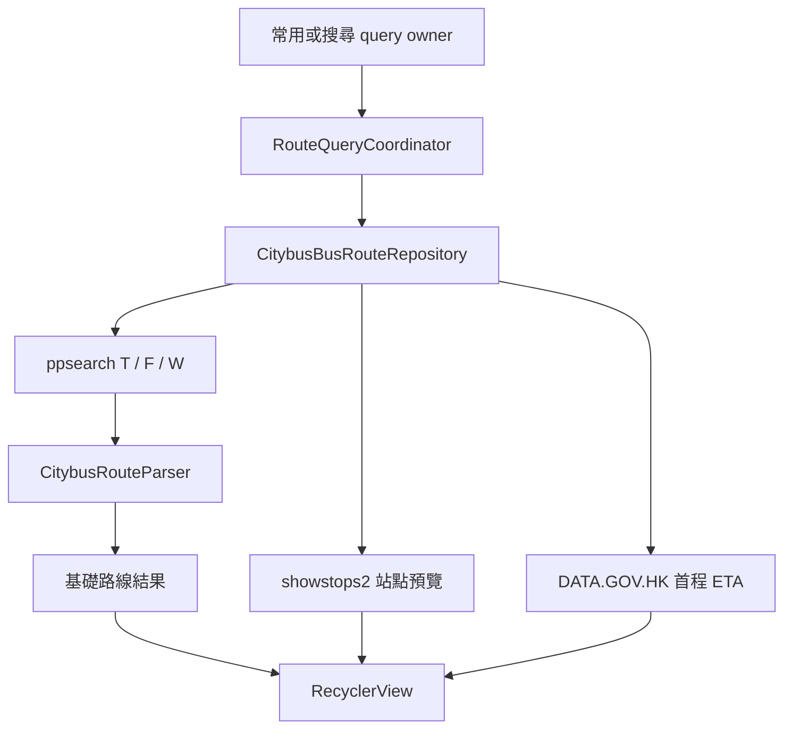

# 目前架構

## 目的

本文描述 BusIsComing 目前已實現的模組、資料流、狀態存儲及生命週期邊界。它不是未來重構藍圖；具體使用者行為以生效 OpenSpec 為準，第三方接口細節由對應主題文件承載。

## 畫面與導航

`MainActivity` 承載三個頂層 destination：

- **常用**：選擇常用行程、查詢路線、排序／刷新、置頂、詳情及監控。
- **搜尋**：編輯臨時起終點、查詢路線，成功後可保存為常用行程。
- **設定**：語言、外觀、行程匯入匯出、乘車碼快捷方式、支援、關於及檢查更新。

行程新增／編輯、行程管理、關於及匯入匯出使用次級 Activity。`TransitCodeShortcutActivity` 是不顯示界面的桌面快捷方式中轉入口；`BusMonitorService` 是前台監控服務。

## 模組責任

| 位置 | 責任 |
| --- | --- |
| `data/local` | SQLite schema、行程／長期置頂資料及語言／外觀偏好 helper |
| `data/localization` | 實際 App locale、Citybus／Google／ETA mapping、TTS 語言及版本 snapshot |
| `data/location` | 位置權限、目前位置、距離、附近行程選擇及 Google 地址解析 |
| `data/model` | 不依賴畫面的行程、路線、ETA、置頂、更新和監控狀態／policy |
| `data/repository` | Citybus／ETA HTTP、parser、cache、路線詳情、本機行程及置頂資料存取 |
| `data/transfer` | `.bicroutes` schema、codec、文件讀取、去重及匯入計劃 |
| `data/update` | 安裝來源、Play／網站 source、渠道決策、提醒 policy 及可靠快照 |
| `service` | 監控 session、ETA 刷新、AlarmManager、通知、WakeLock 及 TTS |
| `ui/common` | 共用地點輸入、查詢結果控制、短文案、IME 及 WindowInsets |
| `ui/main` | 頂層 destination、結果清單、詳情、ETA 面板、置頂、更新和快捷入口 |
| `ui/edit`、`ui/manage` | 行程新增／編輯、複製及管理 |
| `ui/navigation`、`ui/settings` | destination 狀態和次級設定頁 |

活動與 Fragment 可以協調 repository／service，但不得直接承載 SQLite、HTTP、HTML／JSON 解析或可獨立測試的長流程 policy。

## 主要資料流

### 行程與路線查詢

常用與搜尋各自保存查詢上下文及 UI 狀態，但共享 repository、結果格式和排序／刷新控件。每次查詢以 query id、repository generation 及語言版本拒絕過期 callback。基礎結果先交付，ETA 與站點預覽按完成順序增量更新，不等待全部外部請求。

### 目前位置與地址

`CurrentLocationCoordinator` 合併同時發起的位置請求。30 秒內的 snapshot 可直接使用；否則先讀 last location，再在需要時發起最長 3 秒的高精度請求。Google reverse geocoding 只負責地址名稱，保存或查詢始終保留原座標；語言版本、座標 cache key 及 in-flight 合併避免舊語言結果污染畫面。

### 監控

路線結果提供首程 `FirstLegEtaQuery`，UI 計算步行時間並建立 monitor session。`BusMonitorService` 立即以前台通知啟動、刷新 ETA、計算出門狀態、持久化 session 並安排下一次刷新／停止。詳細算法見 `monitoring-design.md`。

### 應用程式更新

`AppUpdateRuntime` 建立 App 級 coordinator。coordinator 串接安裝來源、Play package probe、Play source、網站 source、policy 和 SharedPreferences state store；`MainActivity`／設定頁只觀察結構化狀態並在前台安全時顯示提示。渠道流程見 `app-update-check.md`。

## 狀態與持久化

| 狀態 | 存儲 | 生命週期／清理 |
| --- | --- | --- |
| 常用行程、使用次數、最近使用時間 | SQLite `route_configs` | 持久保存；刪除行程時刪除關聯長期置頂 |
| 長期路線置頂 | SQLite `route_result_pins` | 以行程 id + 版本化 fingerprint 唯一；起終點改變時清除，僅改名保留 |
| 語言、外觀 | 各自 SharedPreferences | 互相獨立；Application 在首個 Activity 前套用 |
| 監控 session | `bus_monitor_session` SharedPreferences | 服務重建可恢復；中斷、到期或到達停止邊界時清除 |
| 更新渠道、可靠快照、defer／skip | 更新專用 SharedPreferences | 安裝版本同步時清理已完成版本狀態 |
| 本次置頂、搜尋表單、destination、排序及滾動 | Fragment／Activity state、SavedState | 配置重建保留；進程或工作流結束後不作長期資料 |
| 路線詳情、stop map、Google 地址等 cache | 進程記憶體 | 按各自 key／TTL；失敗通常不作成功 cache |

SQLite schema 目前為版本 4。`route_configs` 保存行程名稱、起終點名稱／精確座標、建立／更新時間、使用次數及最近使用時間；`route_result_pins` 以外鍵關聯行程並啟用 cascade delete。

Android Manifest 目前允許系統備份，但 backup rules 仍未定義明確 include／exclude，詳見 `technical-debt.md`。

## 重建、取消與語言版本

- 語言或主題切換由 AppCompat recreation 套用，不維護第二套手動 resource configuration。
- destination、行程／臨時起終點、未提交文字、排序、滾動及是否已提交有效查詢可恢復；舊路線結果不跨語言直接保存。
- 已提交上下文在新語言重建後以原座標重查；自動重查不增加行程使用次數。
- query owner 銷毀、提交新查詢或語言版本改變時，舊 callback 不得更新新畫面或語言相關 cache。
- 監控 session 不因 Activity recreation 終止；語言改變時服務更新通知和 source 語言，並停止舊語音 utterance。

## 依賴方向

- UI 可依賴 model、repository、location、update 及 service 的公開接口。
- repository／service 不依賴 Activity 或具體 View。
- formatter 和 policy 優先接收結構化資料與 locale 資源，不返回硬編碼 App 文案。
- 測試注入點可替換 clock、source、fetcher、store 或 callback executor，但生產接線必須使用真實來源。

## 延伸文件

- 行程與結果工作流：`journey-query-workflow.md`
- Citybus、站點與 ETA：`citybus-route-query-and-eta.md`
- 監控算法與背景限制：`monitoring-design.md`
- 三語與動態資料：`localization-guidelines.md`
- UI／UX 原則、共用模式與無障礙：`ui-style-guide.md`
- 文件本身的維護：`documentation-governance.md`
