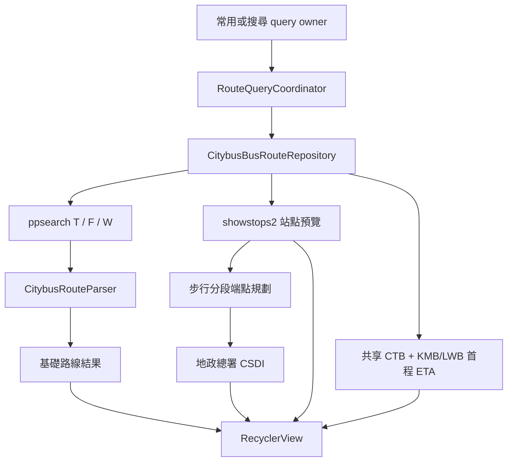
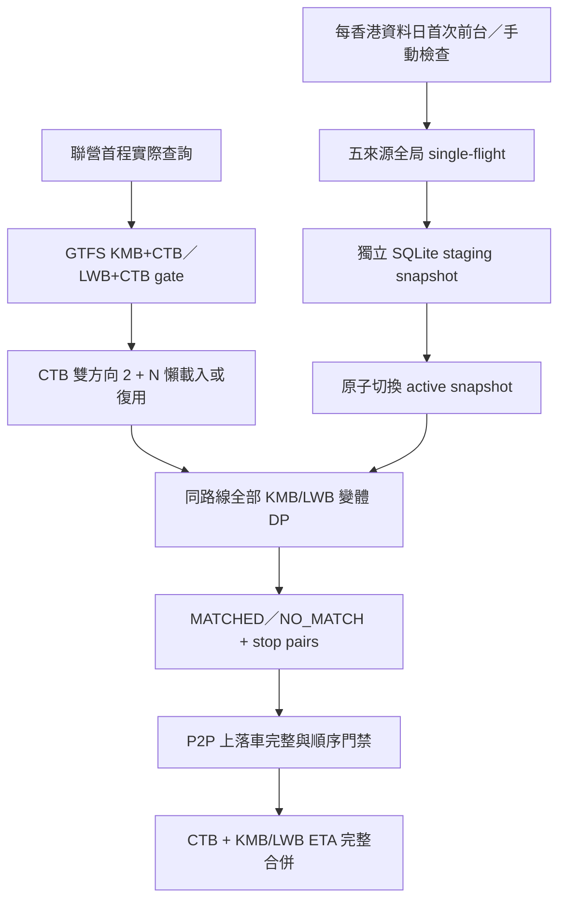
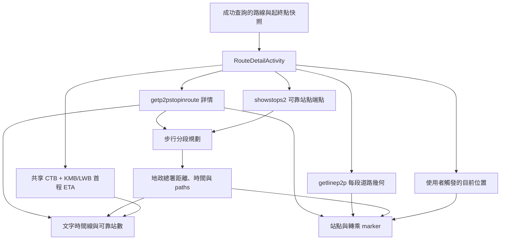

# 目前架構

## 目的

本文描述 BusIsComing 目前已實現的模組、資料流、狀態存儲及生命週期邊界。它不是未來重構藍圖；具體使用者行為以生效 OpenSpec 為準，第三方接口細節由對應主題文件承載。

## 畫面與導航

`MainActivity` 承載三個頂層 destination：

- **常用**：選擇常用行程、查詢路線、排序／刷新、置頂、詳情及監控。
- **搜尋**：編輯臨時起終點、查詢路線，成功後可保存為常用行程。
- **設定**：語言、外觀、自動刷新、行程匯入匯出、路線資料庫更新檢查、乘車碼快捷方式、支援、應用評分、關於及檢查更新。

行程新增／編輯、行程管理、路線詳情、關於及匯入匯出使用次級 Activity。`RouteDetailActivity` 以 Google 地圖為背景、不可隱藏的三檔持續 Bottom Sheet 為文字詳情層；`TransitCodeShortcutActivity` 是不顯示界面的桌面快捷方式中轉入口，`BusMonitorService` 是前台監控服務。

## 模組責任

| 位置 | 責任 |
| --- | --- |
| `data/local` | 用戶 SQLite schema、獨立跨營運商靜態快照／映射 cache、行程／長期置頂資料及語言／外觀／自動刷新偏好 helper |
| `data/localization` | 實際 App locale、Citybus／Google／ETA mapping、TTS 語言及版本 snapshot |
| `data/location` | 位置權限、目前位置、距離、附近行程選擇及 Google 地址解析 |
| `data/model` | 不依賴畫面的行程、路線、ETA、置頂、更新和監控狀態／policy |
| `data/repository` | Citybus、GTFS、KMB／LWB、ETA 與地政總署行人路線 HTTP／parser，跨營運商 DP／更新、短期 Citybus session、詳情／geometry／步行 cache、本機行程及置頂資料存取 |
| `data/transfer` | `.bicroutes` schema、codec、文件讀取、去重及匯入計劃 |
| `data/update` | 安裝來源、Play／網站 source、渠道決策、提醒 policy、評分導航及可靠快照 |
| `service` | 監控 session、ETA 刷新、AlarmManager、通知、WakeLock 及 TTS |
| `ui/common` | 共用地點輸入、查詢結果控制、短文案、IME 及 WindowInsets |
| `ui/main` | 頂層 destination、結果清單、全螢幕地圖詳情、ETA 面板、監控設定、置頂、更新和快捷入口 |
| `ui/edit`、`ui/manage` | 行程新增／編輯、複製及管理 |
| `ui/navigation`、`ui/settings` | destination 狀態和次級設定頁 |

活動與 Fragment 可以協調 repository／service，但不得直接承載 SQLite、HTTP、HTML／JSON 解析或可獨立測試的長流程 policy。

## 主要資料流

### 行程與路線查詢

常用與搜尋各自保存查詢上下文及 UI 狀態，但共享 repository、結果格式和排序／刷新控件。每次查詢以 query id、repository generation 及語言版本拒絕過期 callback。基礎結果先交付，Citybus ETA、按需完成的 KMB／LWB 映射與合併 ETA、站點預覽及 CSDI 步行距離按完成順序增量更新，不等待全部外部請求；CSDI 尚未完成的結果保持穩定相對次序，只有目前按步行距離排序時才重排未置頂區。

### 跨營運商靜態資料與 ETA

`CrossOperatorEtaRuntime` 在 `Application` 初始化，持有獨立路線資料庫、全局更新協調器、CTB route slice loader、映射 repository 及共享首程 ETA service。路線查詢、全螢幕詳情、前台自動刷新與 `BusMonitorService` 使用同一 runtime；無快照、非聯營、slice／映射失敗或資料庫故障均保留 Citybus-only 結果。DP、fingerprint、cache、P2P gate 及資料日細節見 `cross-operator-route-stop-matching.md`。

兩個 owner 各自持有 `ForegroundAutoRefreshController`。全 App 共用設定預設 1 分鐘，可關閉或改為 2／5／10 分鐘；只有目前 destination 前台可見、已有成功結果且沒有首次／手動查詢時才排程。自動刷新重跑原查詢快照，基礎結果完成即結束本輪，後續 ETA、站點與 CSDI callback 繼續漸進交付；列表以 stable id 與 pixel offset 恢復閱讀位置。

### 路線詳情

詳情結構、動態詳情、geometry、Maps、CSDI 步行、位置及 ETA 是互相獨立的載入域。`RouteDetailPageState` 以 page／domain generation、stable key 和 `Refreshing(previous)` 在主線程單調歸併；任一來源失敗都不清除其他已成功內容。完整連續站序才可發布並寫入 24 小時進程 cache；相同詳情 identity 由進程級 single-flight 共用，動態時間、票價、ETA、session 及 UI 狀態不進入結構 cache。

geometry 可早於文字詳情成為內部 candidate，只有目前 consumer 的可靠端點驗證通過後才發布；巴士 geometry 或 CSDI path 失敗均不以端點直線冒充路徑。Map 首幀位於香港，可靠結構完成後最多自動全覽一次，使用者手勢取得相機所有權後，晚到資料、Bottom Sheet 或刷新不再搶回鏡頭。地圖 renderer 以 stable id 增量更新 marker／line，方向折角與站名只在穩定視口重排，拖動詳情窗時避免逐幀重建。

詳情沿用同一前台自動刷新設定；每輪並發刷新完整 Citybus 動態詳情與首程 ETA，只歸併身份匹配的新鮮時間與票價，不重請 geometry 或 CSDI。進入後台、離開頁面、切換語言或關閉設定時取消／作廢本輪，MapView、callback generation 及載入 handle 跟隨 Activity 建立、重建和銷毀。

### 目前位置與地址

`CurrentLocationCoordinator` 合併同時發起的位置請求。30 秒內的 snapshot 可直接使用；否則先讀 last location，再在需要時發起最長 3 秒的高精度請求。Google reverse geocoding 只負責地址名稱，保存或查詢始終保留原座標；語言版本、座標 cache key 及 in-flight 合併避免舊語言結果污染畫面。

### 監控

路線結果提供首程 `FirstLegEtaQuery`，UI 先以 Citybus 步行距離、直線距離、速度、場景及手動偏移建立步行估算。啟動 coordinator 依次處理通知權限／頻道健康、精確鬧鐘能力及電池最佳化豁免；只有通知阻斷狀態必須修復，其他能力拒絕或不可用時可降級繼續。`BusMonitorService` 再以前台通知啟動、刷新 ETA、計算出門狀態、持久化 session 並安排下一次刷新／停止。詳細算法見 `monitoring-design.md`。

### 應用程式更新

`AppUpdateRuntime` 建立 App 級 coordinator。coordinator 串接安裝來源、Play package probe、Play source、網站 source、policy 和 SharedPreferences state store；`MainActivity`／設定頁只觀察結構化狀態並在前台安全時顯示提示。應用評分共用四態 Play 可用性 detector，但使用獨立 navigator，只打開 package-restricted 官方商品頁或對應恢復入口，不改變更新渠道。渠道流程見 `app-update-check.md`。

## 狀態與持久化

| 狀態 | 存儲 | 生命週期／清理 |
| --- | --- | --- |
| 常用行程、使用次數、最近使用時間 | SQLite `route_configs` | 持久保存；刪除行程時刪除關聯長期置頂 |
| 長期路線置頂 | SQLite `route_result_pins` | 以行程 id + 版本化 fingerprint 唯一；起終點改變時清除，僅改名保留 |
| 語言、外觀 | 各自 SharedPreferences | 互相獨立；Application 在首個 Activity 前套用 |
| 自動刷新間隔、首次提示完成狀態 | 自動刷新專用 SharedPreferences | 全 App 共用；關閉／1／2／5／10 分鐘即時通知目前可見 owner，首次提示完成後不重播 |
| 監控 session | `bus_monitor_session` SharedPreferences | 服務重建可恢復；中斷、到期或到達停止邊界時清除 |
| 更新渠道、可靠快照、defer／skip | 更新專用 SharedPreferences | 安裝版本同步時清理已完成版本狀態 |
| 本次置頂、搜尋表單、destination、排序及滾動 | Fragment／Activity state、SavedState | 配置重建保留；進程或工作流結束後不作長期資料 |
| Citybus 詳情 session reference | 進程記憶體 | 每個 `m1` 候選各自持有不透明 reference；原始 `PHPSESSID` 不持久化，預設 30 分鐘過期或由新查詢 scope 作廢 |
| 路線結構、Citybus／CSDI 分段步行、geometry、stop map、Google 地址等 cache | 進程記憶體 | 按資料域使用獨立 key／TTL；完整成功資料才進相應 cache，失敗與部分資料不冒充完整成功 |
| 跨營運商全局快照、CTB route slice 及 DP 映射 | 獨立 SQLite `cross_operator_routes.db` | 可重建；五來源原子發布，slice 按路線懶載入，語義／算法版本精準失效，排除系統備份與裝置轉移 |

SQLite schema 目前為版本 4。`route_configs` 保存行程名稱、起終點名稱／精確座標、建立／更新時間、使用次數及最近使用時間；`route_result_pins` 以外鍵關聯行程並啟用 cascade delete。

Android Manifest 目前允許系統備份；規則已明確排除可重建的 `cross_operator_routes.db`。其他用戶資料的完整 include／exclude 決策仍未完成，詳見 `technical-debt.md`。

## 重建、取消與語言版本

- 語言或主題切換由 AppCompat recreation 套用，不維護第二套手動 resource configuration。
- destination、行程／臨時起終點、未提交文字、排序、滾動及是否已提交有效查詢可恢復；舊路線結果不跨語言直接保存。
- 已提交上下文在新語言重建後以原座標重查；自動重查不增加行程使用次數。
- query owner 銷毀、提交新查詢或語言版本改變時，舊 callback 不得更新新畫面或語言相關 cache。
- 路線詳情以 primitive launch snapshot 支持 Activity 重建；detail、geometry、walking、ETA、Map 及位置 callback 各自用 generation／生命週期拒絕過期交付。
- 監控 session 不因 Activity recreation 終止；語言改變時服務更新通知和 source 語言，並停止舊語音 utterance。

## 依賴方向

- UI 可依賴 model、repository、location、update 及 service 的公開接口。
- repository／service 不依賴 Activity 或具體 View。
- formatter 和 policy 優先接收結構化資料與 locale 資源，不返回硬編碼 App 文案。
- 測試注入點可替換 clock、source、fetcher、store 或 callback executor，但生產接線必須使用真實來源。

## 延伸文件

- 行程與結果工作流：`journey-query-workflow.md`
- Citybus、站點與 ETA：`citybus-route-query-and-eta.md`
- 跨營運商路線與站點映射：`cross-operator-route-stop-matching.md`
- 監控算法與背景限制：`monitoring-design.md`
- 三語與動態資料：`localization-guidelines.md`
- UI／UX 原則、共用模式與無障礙：`ui-style-guide.md`
- 文件本身的維護：`documentation-governance.md`
