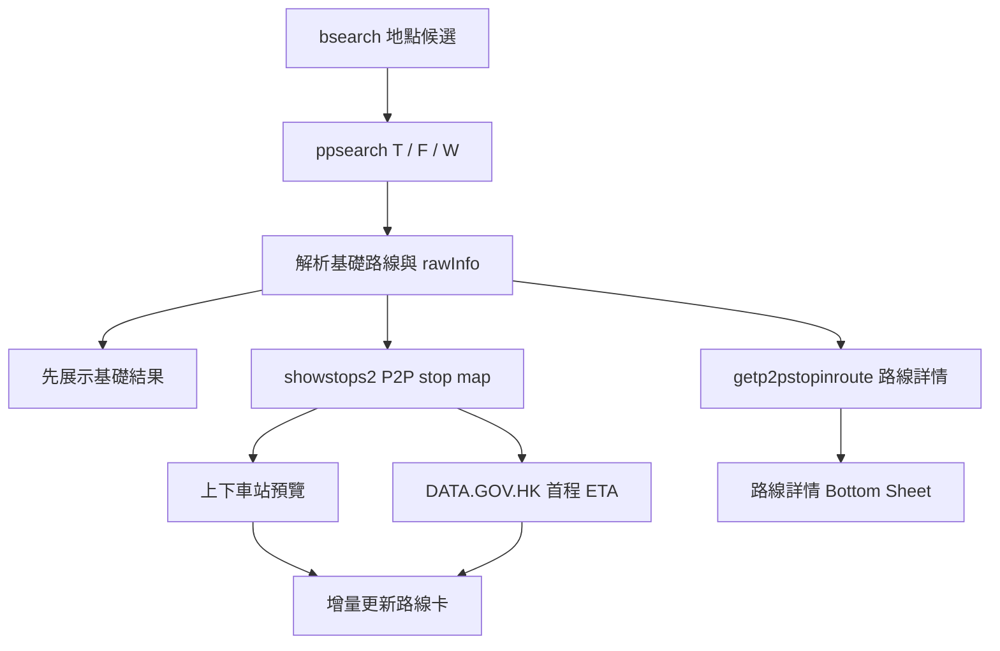

# Citybus 路線查詢與首程 ETA

## 目的

本文記錄目前生產鏈路中 Citybus 地點、點到點路線、P2P stop map、路線詳情與 DATA.GOV.HK ETA 如何協作。它描述上游原始資料、App 解析與展示之間的邊界，避免以公開 route-stop、fixture 或舊實驗假設替代目前 runtime。

## 語言與請求共同規則

每次網絡工作開始時捕獲不可變 `LanguageSnapshot`：

| App 實際語言 | Citybus `l` | DATA.GOV.HK 欄位順序 |
| --- | --- | --- |
| 香港繁體 | `0` | `tc → sc → en` |
| 簡體 | `2` | `sc → tc → en` |
| English | `1` | `en → tc → sc` |

Citybus mobile 請求不附加 Cookie、Referer、User-Agent 或 X-Requested-With 等瀏覽器 header。整體請求失敗不得切換語言重試；cache、in-flight 合併及 callback 必須隔離或核對語言版本。

## 整體資料流



## 地點搜尋

```text
GET https://mobile.citybus.com.hk/nwp3/bsearch_p3.php
    ?q=<query>
    &limit=100
    &timestamp=<millis>
    &l=<lang>
```

`q`、`limit=100`、`timestamp` 和 `l` 均屬目前契約。parser 產生具有名稱及精確座標的 `Place`；只有與目前文字、query generation 和語言版本一致的候選才交給 UI。失敗或無結果不使用 fixture／舊 cache 生成假候選。

## 點到點路線查詢

`CitybusBusRouteRepository` 對同一起終點和香港時間並發查詢三個 `m1` 模式：`T`、`F`、`W`。

```text
GET https://mobile.citybus.com.hk/nwp3/ppsearch_p3.php
    ?slat=<origin latitude>
    &slon=<origin longitude>
    &elat=<destination latitude>
    &elon=<destination longitude>
    &t=<Asia/Hong_Kong yyyy-MM-dd HH:mm>
    &ws=1.3
    &leg=2
    &m1=<T|F|W>
    &l=<lang>
```

三個模式中至少一個成功即可返回部分結果；全部失敗才返回查詢失敗。聚合以乘車段列表、價格、總耗時、步行距離及 P2P `rawInfo` 去重，優先保留具有首程 ETA query 的重複項，基礎結果按總耗時排列。

HTML parser 提取路線、車費、耗時、步行距離、Citybus `showroutep2p(...)`／`showroutestop(...)` 的 `rawInfo` 及詳情參數。parser 只解析上游資料，不產生本地化 UI 句子。

## P2P `rawInfo`

典型值：

```text
2|*|CTB||8X-THR-1||6||31||O|*|CTB||1-MAF-1||5||15||I|*|
```

拆解：

```text
第一項 2                         乘車段數
CTB || 8X-THR-1 || 6 || 31 || O
公司    route variant  上車 下車 bound
```

`8X-THR-1` 是 Citybus 內部 route variant；公開 ETA 路線號是 `8X`。上／下車 seq 是 P2P variant 內站序，不能假設與 DATA.GOV.HK 公開 route-stop 站序相同。

## P2P stop map

```text
GET https://mobile.citybus.com.hk/nwp3/showstops2.php
    ?r=<rawInfo>
    &l=<lang>
```

返回 HTML／script 中的 `addstoponmap(...)` 提供 route variant、bound、seq、stop id、名稱及座標。App 建立 `P2pStopMap` 後，按以下順序找站：

1. `legIndex + routeVariant + sequence` 精確匹配。
2. 找不到時，以 `routeVariant + sequence` 回退，兼容上游 leg index 信息不足。

首程 ETA 使用第一乘車段的上車 seq；卡片預覽使用各段上下車站。展示名稱移除上游 sequence 前綴並按目前 formatter 取主要站名，stop id 和座標仍保留完整身份。

成功且非空的 stop map 按 `rawInfo + lang` 在進程內快取 24 小時；失敗、空內容或解析失敗不作成功快取。ETA 管線和站點預覽管線各自按 request key 合併同類路線，但 `CitybusP2pStopMapResolver` 本身沒有跨管線 single-flight；兩條管線在成功 cache 建立前並發到達時，仍可能各自發出一次 `showstops2` 請求。不得把目前行為描述為全局「同一 rawInfo 保證只請求一次」。

`showstops2` 失敗、缺少站點或無法匹配時，卡片預覽／ETA 分別顯示不可用，不回退 DATA.GOV.HK 公開 `route-stop`。舊 `CitybusRouteStopResolver` helper 只作歷史診斷。

## 首程 ETA

取得 stop id 後：

```text
GET https://rt.data.gov.hk/v2/transport/citybus/eta/{company}/{stopId}/{publicRoute}
```

匹配規則：

1. 先篩選 `route + stop + dir` 完全匹配且 ETA 可解析的記錄。
2. 優先使用 `seq == boardingSeq` 的嚴格記錄。
3. 嚴格記錄不存在時，回退同一 `route + stop + dir`，不得跨路線、站點或方向。
4. 按 `eta_seq`、ETA 時間排序，最多返回三班。
5. 候車分鐘向上取整；已到或已過時間顯示 0 分鐘。

目的地和備註按 App 語言選擇官方 `tc/sc/en` 單欄位回退，並記錄實際欄位語言。`generated_timestamp` 或 `data_timestamp` 用於更新時間；不得把回退值寫入已保存地點或跨語言 cache。

結構化結果區分：缺少首程資料、stop map 請求失敗、stop map 無效、上車站找不到、ETA 請求失敗、ETA response 無效、目前無班次及可用班次。ETA 不可用不隱藏整條路線。

## 路線詳情

```text
GET https://mobile.citybus.com.hk/nwp3/getp2pstopinroute.php
    ?info=<rawInfo>
    &ginfo=<ginfo>
    &lid=<lid>
    &l=<lang>
```

詳情展示上下車站、方向、途經站及換乘段。`ginfo` 和 `lid` 均保留；現有真實樣本已證明移除 `ginfo` 會缺失全程分鐘／到達資訊，而單一 `lid` 樣本不足以證明可安全刪除。詳情 cache key 包含 query 身份和語言，成功資料預設快取 24 小時。

卡片 stop map 和詳情 response 是兩個上游來源。短時間不一致時，各自展示其對應內容並記錄診斷，不讓卡片資料覆寫詳情。

## 取消、增量更新與去重

- `RouteQueryCoordinator` 以 query id、owner active 狀態和語言版本交付 callback。
- repository 提交新 progressive query 時使舊 ETA／預覽 generation 作廢並關閉舊 executor。
- 相同首程 ETA request key 的路線在 ETA 管線內合併一次請求，再把結果分發到多個 result id。
- 相同詳情 cache key 的路線在預覽管線內合併一次解析。
- ETA 與預覽互不等待；快者先更新對應卡片。

## 變更與驗證要求

修改 URL、參數、header、HTML／JSON parser、route variant、seq、stop id 或語言 mapping 時：

- 保存脫敏等價請求或原始 fixture，不把完整座標、API key 或個人行程寫入日誌。
- 覆蓋三語、日／夜、直達／換乘、部分 m1 失敗、空資料、格式漂移和過期 callback。
- 以真實服務確認 fixture 仍代表目前上游；真實失敗不得改用 fixture 作生產結果。
- 若要引入公開 route-stop fallback、跨管線 single-flight 或新 cache，先建立 OpenSpec change 說明身份準確性、失敗和並發影響。

行程與結果 UI 工作流見 `journey-query-workflow.md`；簡體站名延期問題見 `technical-debt.md`。
