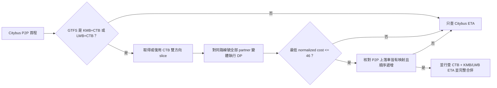

# 跨營運商路線與站點映射

## 目的與邊界

本文記錄 BusIsComing 第一版 CTB ↔ KMB／LWB 路線與站點映射。它解決聯營路線的兩家公司使用不同 stop ID，令 Citybus P2P 上車站不能直接查詢 KMB Data API ETA 的問題。

第一版只補充 Citybus 查詢結果的首程 ETA：路線規劃及 P2P 上落車身份仍由 Citybus mobile 提供；不加入 KMB／LWB 路線規劃，不以站名、最近站或方向字母猜測映射，也不處理後續乘車段 ETA。

## 官方資料來源

### 每香港資料日全局檢查

一次完整檢查固定包含五個 GET：

| 來源 | 保存語義 |
| --- | --- |
| 運輸署公共交通 GTFS `gtfs.zip` 的 `routes.txt` | `agency_id=KMB+CTB`／`LWB+CTB` 的聯營路線號 |
| KMB Data API `/v1/transport/kmb/route/` | route、bound、service type；現時全量資料未必帶 `co` |
| KMB Data API `/v1/transport/kmb/route-stop` | route、bound、service type、seq、stop ID；現時全量資料未必帶 `co` |
| KMB Data API `/v1/transport/kmb/stop` | stop ID、WGS84 座標及三語名稱 |
| DATA.GOV.HK Citybus `/v2/transport/citybus/route/CTB` | CTB 全量路線清單；全量回應未必帶 bound |

KMB 靜態 route／route-stop 沒有 `co` 時，只有 GTFS 已確認聯營的路線才以 GTFS partner 補成 KMB 或 LWB；非聯營記錄預設為 KMB。明確但未知的 `co` 不會被猜測。這項兼容只適用靜態資料；KMB ETA 的 `co` 必須嚴格存在及匹配。

香港資料日使用 `Asia/Hong_Kong`，每日 `05:15` 為分界。App 沒有快照時在首次前台立即檢查；已有快照時每個資料日首次前台檢查。App 未啟動時不排程。設定頁手動檢查會繞過資料日門禁，但與自動檢查共用 single-flight。

### 聯營路線按需載入

CTB 沒有一個可一次取得全量 route-stop 與 stop 的 endpoint。GTFS gate 命中且使用者實際查詢該路線時，App 才請求：

1. `/route-stop/CTB/{route}/outbound`；
2. `/route-stop/CTB/{route}/inbound`；
3. 對兩個方向去重後的每個 stop ID 請求 `/stop/{stopId}`。

所以首次上界是 `2 + N` 個 CTB 請求。完整雙方向資料才可原子發布；任何部分失敗保留舊 slice。新資料日已有舊 slice 時先使用舊映射，背景驗證新 slice；語義未改變不重算 DP。

## 本機資料與版本身份

跨營運商資料使用獨立、可重建並排除 Android backup／device transfer 的 `cross_operator_routes.db`，不修改保存用戶行程的 `bus_is_coming.db`。

主要資料分為：

| 類別 | 內容 |
| --- | --- |
| `snapshot`／`metadata` | immutable snapshot、香港資料日、完整成功時間及 active pointer |
| `joint_route` | GTFS route → KMB／LWB partner |
| `source_cache` | 五個來源的 ETag、Last-Modified 及 gzip 壓縮原始 body |
| `route_variant`／`route_variant_stop` | 聯營 KMB／LWB 的 co、route、bound、service type 與有序站點 |
| `ctb_route_slice`／`ctb_route_slice_stop` | 按 route + direction 的 CTB 有序站點、驗證資料日與 fingerprint |
| `route_match`／`route_match_pair` | winner、cost、算法常數、輸入版本及 CTB → partner stop 對應 |

五個來源全部成功、解析和引用校驗通過後才寫 staging snapshot，再以單一 SQLite 交易切換 active pointer；切換後才級聯清理 inactive snapshot。大型原始 body 以 gzip 保存，避免 Android CursorWindow 載入大型 KMB route-stop 時溢出。資料庫缺失、不可讀或匹配未就緒時，ETA consumer 回退 Citybus-only。

入庫校驗包含必要 ID、正數且唯一的 sequence、合法 WGS84 座標及 route-stop → stop 引用。DP 只接收已驗證的不可變站序，不在每次計算重做資料來源校驗。

語義 fingerprint 只包含會影響 DP 的 co、route、direction／bound、service type、seq、stop ID 和座標。站名、上游 timestamp、JSON／CSV 原始順序及其他 metadata 不令匹配失效。

## GTFS gate 與全候選 DP



對 CTB 站序 `A=(a1…am)` 與一個 KMB／LWB 候選 `B=(b1…bn)`，`d(ai,bj)` 是 Haversine 距離（米），跳過任一方一站的成本 `G=100m`：

```text
D[0][0] = 0
D[i][0] = iG
D[0][j] = jG
D[i][j] = min(
    D[i-1][j-1] + d(ai,bj),
    D[i-1][j]   + G,
    D[i][j-1]   + G
)

rawCost        = D[m][n]
normalizedCost = rawCost / max(m,n)
```

每個 CTB direction 都與相同路線號的全部 partner `co + bound + service_type` 變體比較，不按方向名、首末站、站名或距離包圍盒預篩選。排序依次使用 normalized cost、raw cost、co、bound、數值化 service type 及原 service type，確保同輸入結果穩定。

最低 winner 只有 `normalizedCost <= T=46m/stop` 才接受。算法沒有站對硬距離門禁、第二名差值、置信度分類或站名標準化。DP 回溯的對角步驟產生站點對；左右 gap 不產生映射。

對一個 `m × n` 候選，時間與記憶體成本均為 `O(mn)`。候選只限同一已通過 GTFS gate 的路線號，且只在首次實際查詢、fingerprint／算法版本變更或確定 cache miss 時執行，所以第一版在手機端可接受。

## P2P 運行時門禁

公開 CTB route-stop 只提供離線對齊站序，不能取代 Citybus P2P `showstops2.php` 的實際乘車分支身份。運行時先以 `legIndex + routeVariant + sequence` 取得 boarding／alighting CTB stop ID，再在同一 DP winner 內查映射。

只有以下條件全部成立才建立 partner ETA query：

- boarding 與 alighting CTB stop ID 各自恰好對應一個 partner stop；
- 兩個 partner stop 都屬同一 winner 的同一 co、bound 和 service type；
- `boarding partner sequence < alighting partner sequence`。

任一端落在 gap、特別班次缺站、映射不唯一或順序相反時，只查 Citybus ETA；不得換用另一方向、另一 service type、同名站或最近站。

## Cache、失效與競態

匹配 cache key 同時核對 CTB fingerprint、active snapshot ID、全部 partner 候選 fingerprint、算法版本、`G` 與 `T`。完整輸入得到的 `MATCHED` 或 `NO_MATCH` 可保存；網絡、解析、取消、資料庫或缺少輸入等暫時失敗不得寫成 `NO_MATCH`。

全局快照更新只令 KMB／LWB 語義已改變的 route cache 失效；CTB route slice fingerprint 改變時，舊 cache 因 key 不匹配而不會命中。DP 寫回前再次核對 snapshot ID 與 CTB fingerprint，輸入已變時丟棄舊結果，最多用新版本重算一次。`G`、`T` 或算法版本調整必須升級 identity，令舊結果全部失效。

## ETA 聚合與展示

winner 產生的請求為：

```text
GET https://data.etabus.gov.hk/v1/transport/kmb/eta/{boardingStopId}/{route}/{serviceType}
```

KMB ETA 單筆回應不包含 `stop`；站點身份由請求 URL 中的 `boardingStopId` 保證。App 對回應嚴格匹配 `co + route + dir + service_type` 及可解析 ETA。`co=LWB` 即保留為龍運，即使 endpoint 位於 `/kmb/`；未知 `co` 忽略。Citybus 與 partner 的有效 arrivals 全部按絕對 ETA、operator code、來源 sequence 穩定排序，合併後重編顯示班序，不跨營運商去重，也不截成最早三班。

路線查詢先交付 Citybus ETA，再漸進交付合併結果。路線卡、詳情、自動刷新和監控共用 App 級首程 ETA runtime；只有 ETA 詳情 Bottom Sheet 以文字膠囊顯示城巴／九巴／龍運，路線卡尺寸、通知及 TTS 文案不增加營運商標籤。

## 校準、例子與已知限制

第一版採用前期 150 個聯營方向樣本校準的 `G=100`、`T=46`：route winner 與門禁接受為 150/150，站對與參考結果一致 3963/3965，148/150 個方向完全一致。差異集中在 `107P I` 與 `115 O`；這是選常數的歷史基線，不是上游永遠不變的保證。

- **118**：用於 KMB 聯營、雙方向、P2P boarding/alighting 與特別班次缺站門禁的主要例子。特別班次若不在 winner 不會被最近站補配。
- **S1／R8**：用於證明 `/kmb/` 靜態／ETA 資料中的 LWB 身份、service type 與多變體 winner 可被保留。
- **環線及分段**：`110`、`170`、`N691` 等只在同一 winner 內以實際 P2P 上落車順序判斷，不以 inbound／outbound 名稱推斷。

`T=46` 對未來大改道仍可能產生誤拒或誤受；沒有第二名差值時，近似同分 winner 由穩定排序決定。調整常數前應以現有 golden corpus 加新真實樣本重跑，檢查 winner、站對、門禁與 P2P 可用性，再升算法版本。

## 真實驗證與可重放證據

普通測試使用帶固定 clock 的裁剪 fixture 驗證 parser、DP、P2P gate、ETA 嚴格過濾、排序、品牌 UI 與 SQLite。真實驗證需以 instrumentation argument `runCrossOperatorLive=true` 明確 opt-in，使用生產 HTTP、parser、SQLite 與 DP。

runner 以白天規劃時間固定驗證 118 P2P，即使測試在夜間執行；ETA 仍查真實當前資料。找到 CTB + KMB／LWB 同時有班次時，獨立 oracle 從同批原始 JSON 核對全部 operator、sequence、排序及絕對時間，並保存脫敏 URL、hash、manifest、UI hierarchy 與截圖。沒有雙方班次時必須 skipped／inconclusive，不能把 fixture、單方 ETA 或空資料聲稱為 live 成功。

2026-08-17 03:39–03:40 香港時間的任務自有 API 36.1、360dp 模擬器驗證完成五源真實更新、118 白天 P2P 冒煙及 P2P gate：CTB 上車站 `001227` 實際映射至 KMB stop `34F421B30D4CBFF5`。當前窗口兩方均沒有有效 ETA，因此沒有取得 CTB + KMB 雙方班次，測試按契約標記 skipped／inconclusive，該次未生成成功見證。

2026-08-18 00:02–00:03 香港時間再次以任務自有 API 36、360dp 模擬器及真實生產請求驗證。118 的 CTB `001227` → KMB `34F421B30D4CBFF5` 映射仍通過，當時只有 KMB ETA；其不含 `stop` 的真實回應已能被解析，不再被錯誤丟棄。隨後以同一生產 HTTP／SQLite／DP／合併／Bottom Sheet 鏈路取得 102 雙營運商見證：CTB `001475` 映射至 KMB `153D32217234A0F0`，`normalizedCost=20.959` 通過 `T=46`，同批原始回應在 UI 顯示城巴 `00:17` 與九巴 `00:31`，九巴記錄同樣沒有 `stop`。runner 已保存脫敏 URL、兩方 response hash、manifest、UI hierarchy 與截圖，並由獨立 oracle 核對營運商、絕對時間與展示行。

## 未來擴展

加入其他營運商前需為 GTFS operator gate、靜態 route variant、ETA 身份欄位、品牌資源及 P2P 端點身份建立同等契約，不能只把 operator enum 擴大。服務端集中更新、版本化 DP／cache 及結果分發的遷移條件見 `technical-debt.md` 的 TD-005；在遷移完成前，客戶端必須保持 Citybus-only 離線／故障回退。
